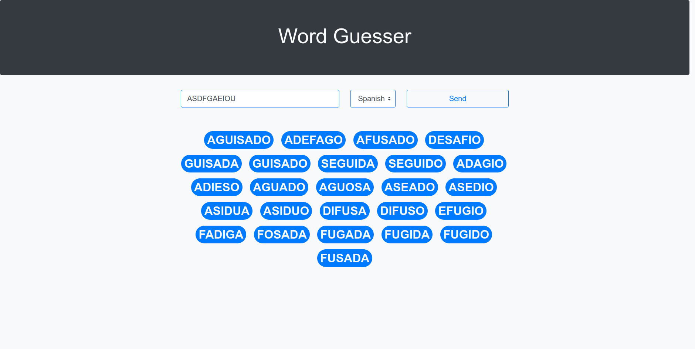

# Word Guesser

This repository contains the source code of a Python 3 library that can guess words from a sequence of unordered letters. The library uses an internal dictionary to validate the words, at this moment supports only spanish and english languages.

## Web application

To demonstrate the use of the library a [simple web application](src/web/) has been created. This demo application can be tried in the [word-guesser web page](https://lmont.es/word-guesser). In the next image we can see a screen capture from the web application.



The application code is also located in this repository. The directory [src/web](src/web/) contains all the frontend code.

The file [src/app/main.py](src/app/main.py) uses the library to implement a REST API that is used by the web application. That API is deployed as a [Cloud Function](https://cloud.google.com/functions) in [Google Cloud](https://cloud.google.com).

In order to ease the deployment of the API as a cloud function the code can be packaged as a zip file. We can use the command `make zip` to do it. When this command is executed it creates a file called **dist/bundle.zip** with all the necessary file structure.

The tested cloud function configuration is:

* **Runtime**: Python 3.11
* **Memory**: 256 MiB
* **Executed function**: cloud_function

## Others

### Test package

```bash
pip install -r requirements-dev.txt
```

```bash
$ make test

pytest test/
=========================================== test session starts ============================================
platform linux -- Python 3.9.5, pytest-8.2.1, pluggy-1.5.0
rootdir: /home/lmontes/git/word-guesser
collected 13 items                                                                                         

test/test_word_guesser.py .............                                                              [100%]

============================================ 13 passed in 4.28s ============================================

### Build package word-guesser

```bash
make lib
```

## Useful links

* [Handling CORS requests in Google Cloud functions](https://cloud.google.com/functions/docs/writing/http?hl=en#handling_cors_requests)
* [Google Cloud functions source code structure](https://cloud.google.com/functions/docs/writing?hl=en#structuring_source_code)
* [Authoritative guide to CORS for REST APIs](https://www.moesif.com/blog/technical/cors/Authoritative-Guide-to-CORS-Cross-Origin-Resource-Sharing-for-REST-APIs/)
* [Replace accent marks preserving special characters](https://stackoverflow.com/questions/29984925/replace-accent-marks-preserving-special-characters)
* [Bootstrap 5.0 docs](https://getbootstrap.com/docs/5.0)
